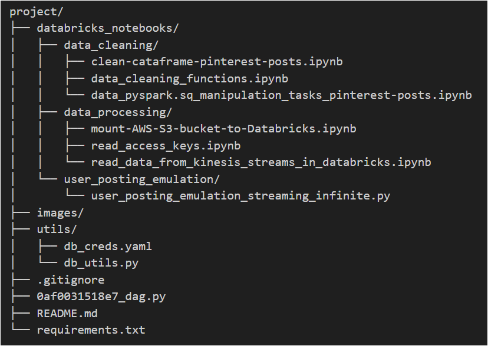

# Pinterest Data Pipeline

## Table of Contents
1. [Description](#description)
2. [Installation](#installation)
3. [Usage](#usage)
4. [File Structure](#file-structure)
5. [License](#license)

## Description
Pinterest processes billions of data points daily to enhance user experience and provide more value to its users. In this project, I created a similar system using the AWS Cloud. The project involves setting up data pipelines, processing streaming data from various sources, performing real-time analysis, and storing the data for further analysis.

The project aims to demonstrate how to read data from Kinesis Data Streams in Databricks, clean the streaming data, and save it to Delta Tables. This involves setting up Kinesis streams, reading data from them, defining schemas, transforming the data, and finally saving it to Delta Tables. The Pinterest Data Pipeline project is designed to simulate how large social media platforms like Pinterest manage data. It provides a hands-on experience with data collection, processing, storage, and analysis in a cloud environment like AWS.

## Proposed Architecture

<!-- Add Image here cloud-pinterest-pipeline.png -->


The architecture leverages several AWS services to create a robust data pipeline:

- **Amazon RDS:** Stores initial Pinterest data (posts, user information, and geolocation).
- **Apache Kafka:** A distributed streaming platform for real-time data ingestion and processing.
- **Amazon S3:** Securely stores processed data for later analysis.
- **API Gateway:** Provides an interface for data streaming into the Kafka cluster.
- **Databricks:** A cloud-based platform for running Apache Spark analytics on the stored data.
- **Managed Workflows for Apache Airflow (MWAA):** Orchestrates complex workflows using Directed Acyclic Graphs (DAGs) to automate data processing and analysis.
- **AWS Kinesis Data Streams:** (Optional) For real-time data management.

## Components and Configuration

1. **AWS Setup (IAM, VPC & EC2)**

- Create an IAM user with least privilege and an IAM role with appropriate permissions for accessing AWS services.
- Set up a VPC, subnets, and a security group for traffic control.
- Launch an EC2 instance with an SSH client.

2. **MSK Cluster Configuration**

- Create an MSK cluster (Apache Kafka) on AWS for real-time data processing.
- Note down the Bootstrap servers string and Apache ZooKeeper connection information.

3. **Kafka Setup on EC2**

- Install Java and download Kafka on the EC2 instance.
- Install the IAM MSK authentication package in the libs folder to connect to MSK clusters with IAM authentication.
- Configure the Kafka client to use AWS IAM using a client.properties file.
- Create Kafka topics (<UserID>.pin, <UserID>.geo, <UserID>.user) to store specific data streams.

4. **S3 Bucket Creation**

- Create an S3 bucket (user-<UserID>-bucket) to store processed data.
- Configure IAM roles for writing access to the bucket or use a VPC Endpoint.

5. **MSK Connect**

- Set up the Confluent.io Amazon S3 Connector package to enable data transfer from Kafka to S3.
- Create a custom plugin and a connector in MSK Connect to automatically store Kafka data in the S3 bucket.

6. **API Gateway**

- Create a REST API in API Gateway to receive data streams from the batch_streaming.py script.
Configure a resource with a PROXY integration for the API.
- Create methods with the HTTP method ANY and configure proxy integration.
- Stage and deploy the API to implement the changes and note down the invoke URL.

7. **Kafka REST Proxy (Optional)**

- Download the Confluent.io Amazon S3 Connector package on a client EC2 machine to communicate with the MSK cluster.
- Configure the REST proxy to communicate with the MSK cluster and perform IAM authentication using a kafka-rest.properties file.
- Start the REST proxy to allow data consumption from the API and storage in the S3 bucket.

8. **Databricks**

- Create a Databricks account, a cluster, and access key/secret key credentials from the IAM user with S3 access.
- Upload an authentication_credentials.csv file containing the keys.
- In a Databricks notebook, use the access_keys.ipynb and mount_s3_to_databricks.ipynb scripts to access the AWS access keys and mount the S3 bucket for data analysis.

9. **MWAA (Optional)**

- Create an MWAA environment (Databricks-Airflow-env) to orchestrate workflows and manage data tasks.
- Set up S3 bucket configuration for MWAA with a bucket named mwaa-dags-bucket (containing a dags folder) and versioning enabled.
- Configure Airflow UI access and integrate with Databricks using an API access token created in Databricks.
- (Optional) Install Airflow Provider Package if needed for Databricks connection type.

10. **AWS Kinesis Data Streams (Optional)**

- Create data streams (streaming-<UserID>-pin, streaming-<UserID>-geo, streaming-<UserID>-user) for real-time data management.

### What it Does
- Cleans and preprocesses Pinterest post data.
- Mounts an AWS S3 bucket to Databricks for data ingestion.
- Submits Databricks jobs to perform specific tasks.
- Streams data to AWS Kinesis for real-time processing.

### Aim of the Project

The project aims to provide hands-on experience with setting up and managing a comprehensive data pipeline for handling Pinterest data. It offers insights into how large-scale applications like Pinterest manage vast amounts of data, ensuring efficient processing and secure storage. The primary goal is to create a robust data pipeline encompassing the following key components:

- Data Emulation: Develop a script to retrieve data from an Amazon RDS, effectively emulating the process of posting data as it occurs on Pinterest.

- Data Processing with Kafka: Implement Apache Kafka to efficiently process the influx of data, ensuring smooth data flow and scalability.

- Data Storage in S3: Utilize Amazon S3 buckets for secure storage of processed data, facilitating easy access for future analysis.

- API Integration for Data Streaming: Develop an API to facilitate the streaming of data into the Kafka cluster, followed by storage in the S3 bucket.

- Data Analysis in Databricks: Connect Databricks to the S3 bucket to conduct comprehensive batch analysis on the stored Pinterest data.

- Workflow Orchestration with MWAA: Employ Managed Workflows for Apache Airflow (MWAA) to orchestrate complex data workflows using Directed Acyclic Graphs (DAGs), enhancing automation and monitoring of the data pipeline.

- Real-time Data Handling with Kinesis: Integrate AWS Kinesis Data Streams to extend the pipeline's capabilities for real-time data management.

By completing this project, participants will gain hands-on experience with tools like Databricks, Kafka, Apache Airflow, AWS S3, and Kinesis, and learn how to integrate them into a cohesive data pipeline for efficient handling of Pinterest data.

### Project Overview: Pinterest Data Pipeline Implementation

The project aims to provide a comprehensive demonstration of building an end-to-end data pipeline for handling Pinterest data. This pipeline encompasses data cleaning, storage, analysis, and real-time streaming, offering hands-on experience with essential tools and technologies such as Databricks, Kafka, Apache Airflow, AWS S3, and Kinesis. Key components of the pipeline include:

- **Data Ingestion with Apache Kafka (AWS MSK):**  Utilizing Apache Kafka, integrated with AWS Managed Streaming for Apache Kafka (MSK), to ingest and buffer incoming Pinterest data streams efficiently.

- **Data Transformation with Apache Spark (On Databricks Notebooks):** Employing Apache Spark, hosted on Databricks notebooks, for performing data transformations and analytics on the ingested Pinterest data streams.

- **Workflow Orchestration with Apache Airflow (AWS MWAA):** Leveraging Apache Airflow, integrated with AWS Managed Workflows for Apache Airflow (MWAA), to orchestrate and automate the data pipeline workflows, ensuring seamless execution and monitoring.

- **Real-time Data Streaming Infrastructure with AWS Kinesis:** Implementing AWS Kinesis as the real-time streaming infrastructure on AWS, enabling the processing and analysis of Pinterest data streams in real-time.

- **API Integration with AWS API Gateway:** Developing APIs using AWS API Gateway to facilitate the interaction between different components of the data pipeline, enabling seamless data streaming and processing.

By completing this project, participants gain practical expertise in designing, implementing, and integrating various components of a scalable and efficient data pipeline for handling Pinterest data. Additionally, they acquire proficiency in using industry-standard tools and technologies essential for building robust data pipelines in a cloud-based environment.

# What I Learned
The Pinterest Data Pipeline Project provided a valuable hands-on experience in building a data processing infrastructure on AWS. Here are the key takeaways that will benefit me in future data engineering projects:

1. **Data Cleaning and Preprocessing with Apache Spark:** I gained proficiency in cleaning and preparing data for analysis using Spark on Databricks notebooks. This included techniques like filtering out irrelevant data, transforming data structures, and aggregating data for efficient processing.

2. AWS Service Integration: I learned how to integrate Databricks with various AWS services to create a comprehensive data pipeline. This project specifically involved working with:
    - Amazon S3: For storing and managing large datasets in a secure and scalable way.
    - Amazon Kinesis Data Streams (Optional): For real-time data ingestion and processing (if you used this component).
    - Amazon Simple Storage Service (Amazon S3): Another reference to Amazon S3, potentially for storing processed data after analysis.

3. Workflow Orchestration with Apache Airflow: I deepened my understanding of Apache Airflow and its capabilities in orchestrating data processing workflows. This included creating **Directed Acyclic Graphs (DAGs)** to schedule and manage the execution of various data processing tasks in a defined sequence, using AWS Glue or AWS Step Functions (if applicable).

4. Streaming Data Processing Techniques: The project exposed me to streaming data processing techniques, particularly leveraging Python scripts to stream data to AWS Kinesis for near-real-time processing (optional).

5. Project Organisation and Documentation Best Practices: I refined my skills in organising project files and creating comprehensive documentation. This involved establishing a clear file structure, writing informative README files, and adding detailed comments within code for better maintainability.

By working on this project, I've gained valuable experience in data wrangling, cloud-based data management with AWS services, and workflow automation using Apache Airflow. These skills will be instrumental in building robust data pipelines for future projects.

### Lambda Architecture

Lambda architecture is a way of processing massive quantities of data (i.e. "Big Data") that provides access to batch-processing and stream-processing methods with a hybrid approach. Lambda architecture is used to solve the problem of computing arbitrary functions. The lambda architecture itself is composed of 3 layers:

Here's how Lambda Architecture fit into the project:


Figure 1: Real-Time Big Data Lambda Architecture

1. Batch Layer: The project involves batch processing for tasks such as data cleaning, preprocessing, and analysis. Databricks notebooks and Apache Spark used for these batch processing tasks. The cleaned and processed data stored in a data lake, such as AWS S3, for further analysis or serving batch queries.

2. Speed Layer: The project involves streaming data processing using AWS Kinesis for real-time or near-real-time data ingestion and processing. Python scripts and Databricks notebooks used to stream data to Kinesis streams. This layer would handle immediate processing and analysis of incoming data streams.

3. Serving Layer: The project involve serving queries against both the batch views and real-time views of the data. Delta tables in Databricks serve as the serving layer, providing low-latency access to the processed data for analytics and downstream applications.

## Installation
To run the project locally, follow these steps:
1. Clone the repository: 

```sh
git clone https://github.com/emma-luk/pinterest-data-pipeline
```

2. Install the required dependencies: 

```
pip install -r requirements.txt
```


## Provisioning Resources

1. AWS (Amazon Web Services)

AWS offers a pay-as-you-go pricing model, where you only pay for the resources you use. They provide various services, each with its own pricing options (on-demand, reserved instances, spot instances). Additionally, AWS offers a free tier for new customers to explore some services.

Provisioned:

- Virtual Private Cloud (VPC): Enhances security by isolating your infrastructure within a logically defined network.
- EC2 Instance: Hosted virtual servers to run your Kafka configurations.
- MSK Cluster (Apache Kafka): Manages real-time data ingestion and processing.
- S3 Bucket: Securely stores processed data for later analysis.
- API Gateway: Provides an interface for data streaming into Kafka.
- Databricks: Cloud-based platform for running Apache Spark analytics on stored data.
- Managed Workflows for Apache Airflow (MWAA) (Optional): Orchestrates complex workflows using Directed Acyclic Graphs (DAGs) to automate data processing and analysis.
- AWS Kinesis Data Streams (Optional): Enables real-time data management.

2. S3 (Amazon Simple Storage Service)

S3 offers a simple pricing model based on data storage, requests made, and additional features used (data transfer, data management). Pricing varies depending on the chosen storage class (Standard, Intelligent-Tiering, Glacier).

- Stores Kafka topics (optional)
- Stores DAGs (optional)

3. Kinesis

Kinesis pricing is based on data volume (ingested and processed), and any additional features used (data retention). It varies depending on the specific Kinesis service used (Kinesis Data Streams, Kinesis Data Firehose, Kinesis Data Analytics).

4. Databricks

Databricks provides a unified Apache Spark analytics platform. It's offered as a fully managed service on AWS with pricing based on used resources (compute instances, storage) and the chosen edition (Community, Standard, Premium).


1. AWS (Amazon Web Services): AWS provides various services under a pay-as-you-go pricing model, where you pay only for the resources you use. AWS offers different pricing options for each service, including on-demand pricing, reserved instances, and spot instances. Additionally, AWS provides a free tier for new customers to get started with some of its services.

- Provisioned a VPC, EC2, MSK cluster, S3 bucekt, API Gateway,....

Virtual Private Cloud (VPC)
- Provisioned due to security reasons to hold all my infrastructure

EC2
- To hold my kafka configurations

MSK
- For my kafka clsuter

2. S3 (Amazon Simple Storage Service): S3 offers a simple pricing model based on the amount of data stored, the number of requests made, and any additional features used (such as data transfer and data management features). Pricing may vary depending on the storage class chosen (e.g., Standard, Intelligent-Tiering, Glacier).

- Kafka topics


- DAG


3. Kinesis: Kinesis offers a pricing model based on the volume of data ingested, the volume of data processed, and any additional features used (such as data retention). Pricing may vary depending on the specific Kinesis service used (e.g., Kinesis Data Streams, Kinesis Data Firehose, Kinesis Data Analytics).

4. Databricks: Databricks provides a unified analytics platform based on Apache Spark, offered as a fully managed service on AWS. Databricks offers pricing based on the resources used (such as compute instances and storage) and the edition chosen (e.g., Community Edition, Standard Edition, Premium Edition).


## Usage

### Key Scripts

1. The user_posting_emulation_streaming_infinite.py

This script connects to a MySQL database, fetches random rows from three tables (pinterest_data, geolocation_data, and user_data), and sends the data to corresponding Kinesis streams via HTTP requests.

2. The user_posting_emulation_streaming.py 

This Python script simulates user posting data to three different Kinesis streams corresponding to Pinterest tables: pin_stream, geo_stream, and user_stream.

3. The user_posting_emulation.py

This script connects to a MySQL database and retrieves random rows from three tables (pinterest_data, geolocation_data, and user_data). It then transforms the data, converting any datetime objects to strings, and sends the transformed data to corresponding Kafka topics via an API.

4. The clean-cataframe-pinterest-posts.ipynb

This notebook performs various data cleaning and analysis tasks on three DataFrames (df_pin, df_geo, df_user) representing Pinterest posts, geolocation data, and user data, respectively.

5. The mount-AWS-S3-bucket-t-Databricks.ipynb

This notebook facilitates the mounting of an AWS S3 bucket, reading data from the mounted bucket into Spark dataframes, and provides an optional step to unmount the bucket once the required operations are completed.

6. The 0af0031518e7_dag.py

This script defines an Apache Airflow DAG (Directed Acyclic Graph) that orchestrates the execution of tasks related to running a Databricks notebook.

### Usage Instructions

1. Set up AWS services such as Kinesis Data Streams, Lambda Architecture, and S3.
2. Configure AWS credentials and permissions.

3. Run the emulation script to send data to Kafka and S3 bucket for batch streaming.

```
python user_posting_emulation.py
```
> Note: Make sure that your REST Proxy is running on the EC2. You need to run this command in the confluent/bin folder: `./kafka-rest-start /home/ec2-user/confluent-7.2.0/etc/kafka-rest/kafka-rest.properties`


4. Run the emulation script to send data to Kinesis for real time streaming.
```
python user_posting_emulation_streaming_infinite.py
```

5. Run the data processing scripts to ingest, transform, and analyse streaming data.
6. Create a Delta table to store authentication credentials in Databricks.
7. Set up Kinesis Data Streams in AWS.
8. Run the notebooks in Databricks to read data from Kinesis streams, define schemas, transform the data, and save it to Delta Tables.

- Open the Databricks notebooks (`databricks_notebooks/`) in your Databricks workspace and execute the cells to perform data cleaning and analysis tasks.
- The Airflow DAG (`0af0031518e7_dag.py`) to orchestrate tasks and workflows.


## File Structure

project/
├── databricks_notebooks/
│   ├── data_cleaning/
│   │   ├── clean-cataframe-pinterest-posts.ipynb
│   │   ├── data_cleaning_functions.ipynb
│   │   └── data_pyspark.sq_manipulation_tasks_pinterest-posts.ipynb
│   ├── data_processing/
│   │   ├── mount-AWS-S3-bucket-to-Databricks.ipynb
│   │   ├── read_access_keys.ipynb
│   │   └── read_data_from_kinesis_streams_in_databricks.ipynb
│   └── user_posting_emulation/
│       └── user_posting_emulation_streaming_infinite.py
├── images/
├── utils/
│   ├── db_creds.yaml
│   └── db_utils.py
├── .gitignore
├── 0af0031518e7_dag.py
├── README.md
└── requirements.txt




Figure 2: Project Directory Structure

## License
This project is based around AWS services and its licencising protocols accordingly.


